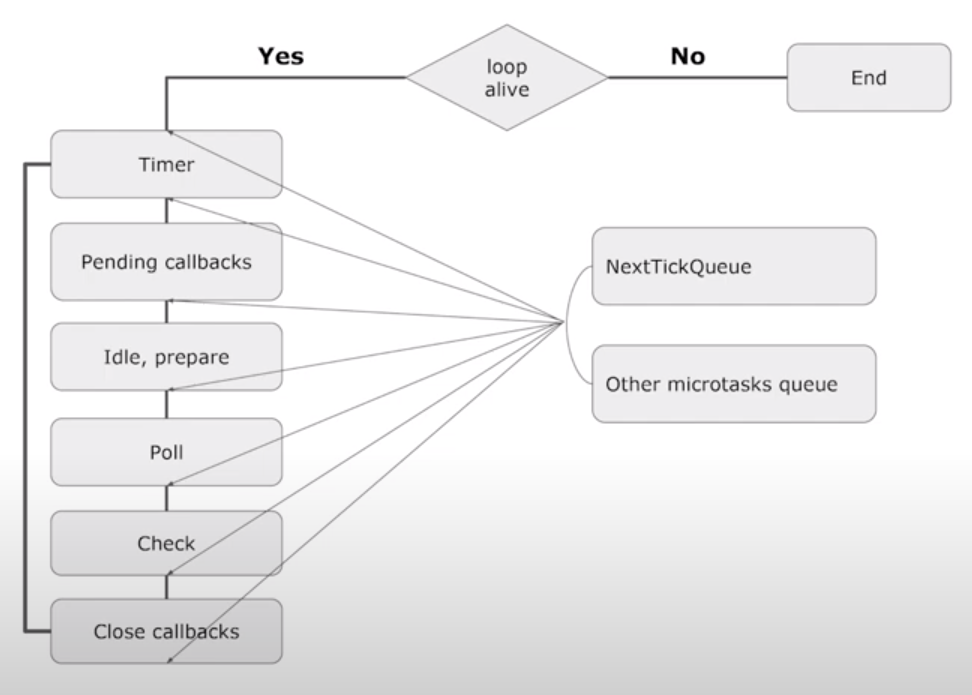

# Code listing from the [Video](https://www.youtube.com/watch?v=HHuKGuIVvTA) with some explanation of what's going on

Here you can see code listing from the video of Ilya Gorkun. The example is very useful if you want to get more or less clear image of how nodeJs event loop
works. Together with explanation in the video and official documentation / material about event loop it looks like quite sufficient information for all who 
strives to understand what is really going on there.

### Sources
https://www.youtube.com/watch?v=HHuKGuIVvTA  

### I'd recommend to read before and after
https://nodejs.org/en/docs/guides/event-loop-timers-and-nexttick/  
https://nodejs.org/en/docs/guides/dont-block-the-event-loop/

### Schema of the way event loop works (from the video)


### Output of the listing
```
START (a)
Promise (d)
Async/Await (j)
END (m)
Promise next tick (e)
Next tick (k)
SetTimeout (b)
SetImmediate (c)
SetTimeout (l)
Read file (f)
Read file next tick (i)
Read file SetImmediate (h)
Read file SetTimeout (g)
```
## Short Process explanation

### Print out START (a)
Init stage of script execution - START (a) printed
#### Async tasks scheduled / thrown into thread pull (named by stages where it should be executed)   
Microtasks (NextTick) - 0  
Microtasks (Promises) - 2  
Timers - 1  
Poll - 1  
Checks - 1  


### Print out Promise (d), Async/Await (j), END (m)
Previously scheduled promises microtasks execution, one after another.
Note - about all of that what is below await statement - 
you can think as of about piece of code wrapped into just another 
promise
#### Async tasks scheduled / thrown into thread pull (including those who were scheduled before)
Microtasks (NextTick) +2 = 2  
Microtasks (Promise) -2 = 0  
Timers +1 = 2  
Poll = 1  
Checks = 1  


### Print out Promise next tick (e), Next tick (k)
Previously scheduled nextTicks microtasks execution  
#### Async tasks scheduled / thrown into thread pull (including those who were scheduled before)
Microtasks (NextTick) -2 = 0  
Microtasks (Promise) = 0  
Timers = 2  
Poll = 1  
Checks = 1  


### Print out SetTimeout (b), SetImmediate (c), SetTimeout(l)
Please pay attention - the order of 3 of these might be different for you - 
It is because when you have timers and setImmediate tasks planned outside I/O callbacks
then node js will decide what to run first depending on what it considers best for performance. For more
details please read the [article](https://nodejs.org/en/docs/guides/event-loop-timers-and-nexttick/)  
But also you can argue - Why it had ignored running poll callback - see it is placed before check phase!
Well as it has explained, the node has some special behavior for it - when it climbs down the poll phase and "sees" there is something in 
check phase or in timers phase - it will (TODO: always?) postpone poll operations, go out of poll phase and execute what is in timers/checks phase first. 
// TODO clarify this - it seems this stage in this exact example can be also affected by fact that reading of file just takes some time?
#### Async tasks scheduled / thrown into thread pull (including those who were scheduled before)
Microtasks (NextTick) = 0  
Microtasks (Promise) = 0  
Timers -2 = 0  
Poll = 1  
Checks -1 = 0  


### Print out Read file (f)
Poll (I/O) task callback execution
#### Async tasks scheduled / thrown into thread pull (including those who were scheduled before)
Microtasks (NextTick) +1 = 1  
Microtasks (Promise) = 0  
Timers +1 = 1  
Poll -1 = 0  
Checks +1 = 1  


### Print out Read file next tick (i)
Well all is clear here - nextTick task callback executed right after Poll phase finished
#### Async tasks scheduled / thrown into thread pull (including those who were scheduled before)
Microtasks (NextTick) -1 = 0  
Microtasks (Promise) = 0  
Timers = 1  
Poll = 0  
Checks = 1

### Print out Read file SetImmediate (h), Read file SetTimeout (g)
Right after poll phase is finished and microtasks queue are emptied - it goes to execution of what is in checks phase
and then - in timers - as it makes loop.
#### Async tasks scheduled / thrown into thread pull (including those who were scheduled before)
Microtasks (NextTick) = 0  
Microtasks (Promise) = 0  
Timers -1 = 0  
Poll = 0  
Checks -1 = 0


